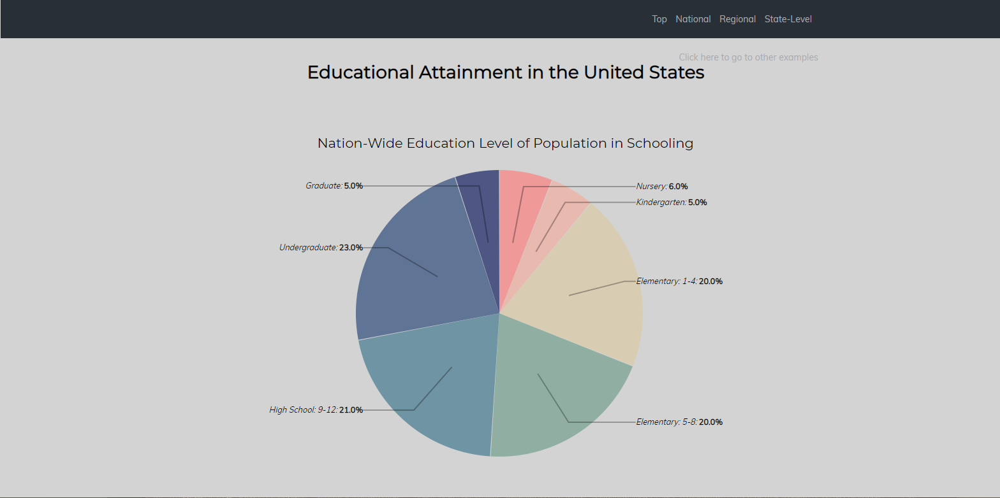
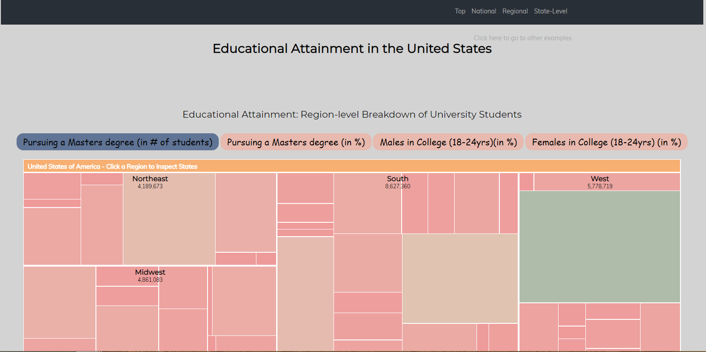
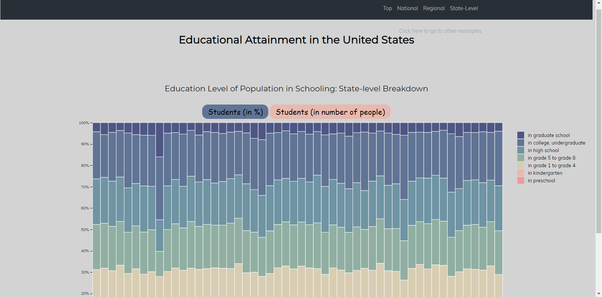
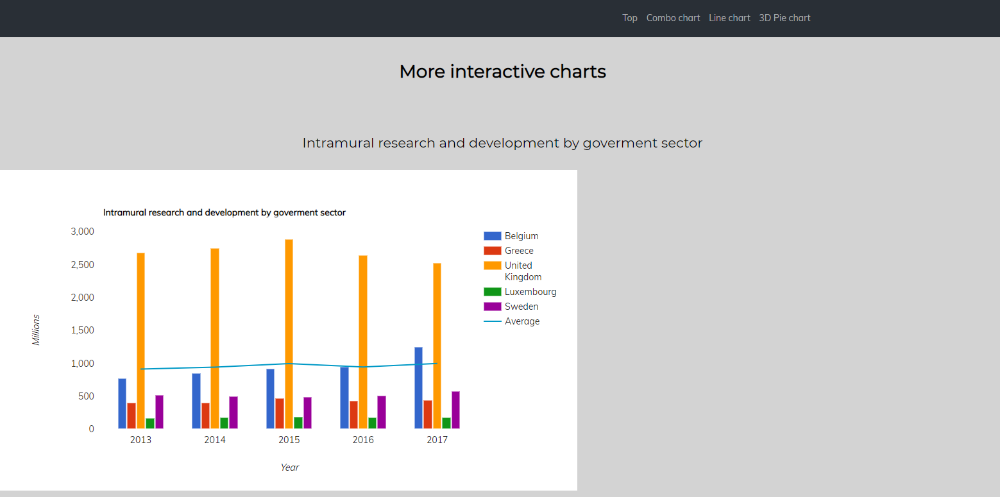
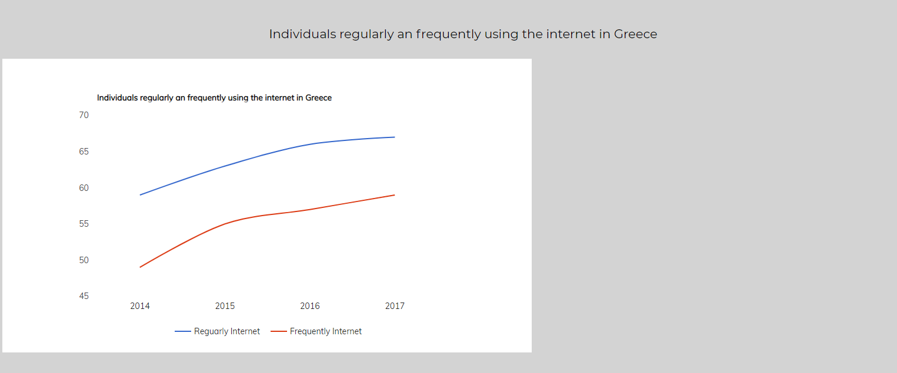
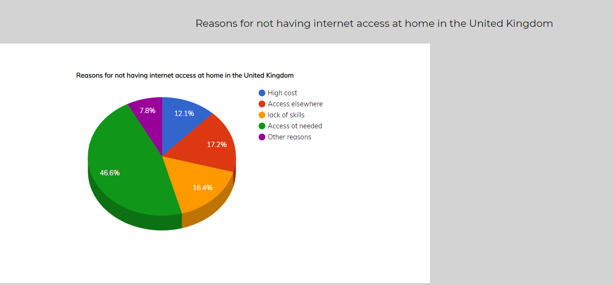

# Επικοινωνία Ανθρώπου-Υπολογιστή Τελική αναφορά
## Εργασία Ανάπτυξης: Οπτικοποίηση δεδομένων εκπαιδευτικού συστήματος (USA) Τελική αναφορά

Tελική αναφορά της εργασίας ανάπτυξης στο μάθημα HCI

### Ονοματεπώνυμο: Φαρμάκη Ευτυχία Μαρλια Δήμητρα
#
### ΑΜ:Π2017070
#
Στην παρακάτω αναφορά, η οποία αποτελει και την τελική αναφορά του μαθήματος, περιέχεται μία εισαγωγή σχετικα με την εργασία αυτή, καθώς και τα συμπεράσματα που προκυπτουν. Παράλληλα, αναλύονται σχετικά έργα και εργαλεία, μέθοδοι και τεχνικές ανάπτυξης αλλα και αποτελέσματα με λεζάντες σε ενδεικτικές οθόνες και animated gif. Παρακάτω δίνονται τα λινκ τα οποία είναι απαραίτητα για την πλήρη αξιολόγηση της εργασίας εξαμήνου:

**Προφιλ του λογαριασμού στο github:https://github.com/eftichiafarmaki**

**Εκτελέσιμο λινκ εργασιας:https://eftichiafarmaki.github.io/D3js-US-educational-attainment/**

**Link αποθετηρίου εργασλιας:https://github.com/eftichiafarmaki/D3js-US-educational-attainment/tree/gh-pages**

**Link αποθετηρίου τελικής αναφοράς:**

### ΕΙΣΑΓΩΓΗ
#

Στην εργασία του μαθήματος αυτού υλοποίησα όλα τα ζητούμενα του πρωτου παραδοτέου και δύο από τα τρία ζητούμενα του δεύτερου παραδοτέου.
Στο δεύτερο παραδοτέο δεν πραγματοποιηθηκε το ζητούμενο το οποίο ζητούσε την αλλαγή γραφηματων. Ωστοσο, παρεμβαίνοντας ελάχιστα στον ήδη υπάρχον κωδικα του πρώτου γραφήματος, πραγματοποιήθηκε μια μικρή αλλαγή στο πρώτο γραφημα οπως θα δείτε και παρακάτω. 
Η δομή της τελικης αυτής αναφοράς θα γίνει στα πλαίσια των ζητουμένων που αναλύονται στις οδηγίες του μαθήματος. 

### Σύντομη ανάλυση σχετικών έργων και εργαλείων

Για την πραγματοποίηση της εργσίας ήταν απαραίτητη η συνεισφορά των εργαλείων των γλωσσών της html, javascript, css μέσω εκπαιδευτικών προγραμμάτων σε google και youtube. Ταυτόχρονα, εγινέ χρήση της βιβλιοθής d3js για την κατανόηση και τοποθέτηση γραφημάτων αλλά και της βιβλιοθήκης google charts. Μια ακόμη βιβλιοθήκη η οποία χρησιμοποιήθηκε για το πρώτο παραδοτέο ηταν η responsivevoice για την υλοποίηση text to speech (link στην βιβλιογραφία).

### Μέθοδος και τεχνικές ανάπτυξης

H διαδικασία και η μέθοδος που ακολούθησα για την εργασία ανάπτυξης ήταν αναλυτικα η εξης:
Για το πρώτο παραδοτέο:
* *Για την αλλαγή χρωμάτων αντικατέστησα σε κάθε αρχείο script τα ήδη υπάρχον χρωματα του γραφήματος με την προσωπική μου επιλογή, μέσω της συνάρτησης .range η οποία είναι υπεύθυνη για την αλλαγή χρωμάτων.*
* *Για την αλλαγή των διεπαφών στα κουμπιά, τροποποίησα το stylesheet αρχείο(css), στο εσωτερικό του οποίου έγινε αλλαγή χρωμάτων, γραμματοσειράς αλλα και αλλαγή του περιγράματος των κουμπιών(πιο στρογγυλές γωνίες).*
* *Στην συνέχεια, για την τοποθέτηση ήχου στα κουμπιά του μενού, χρησιμοποίησα το στοιχείο onmouseover σε κάθε ένα απο αυτά τα κουμπιά, και παράλληλα την τοποθέτηση των κατάλληλων script στον κώδικα. Την συνάρτηση αυτή την τοποθέτησα ύστερα από αναζήτηση σε google και youtube, και με την βοηθεια του stackoverflow.*
* *Για την τοποθέτηση φωνής, χρησιμοποίησα την συνάστηση responcivevoice σε καθε τιτλο της σελ΄ίδας. Για την σωστή ΄λειτουργία της έγινε τοποθέτηση των κατάλληλων script.*

Για το δεύτερο παραδοτέο:
* *Για το πρώτο ζητούμενο χρησιμοποίησα μία συνάρτηση της οποίας η λειτουργία είναι η εμφάνιση και η απόκρυψη των γράφηματων κάθε φορα και την οποία ονόμασα showhide. Η τοποθέτησή της έγινε ύστερα από αναζήτηση στο διαδικτυο και πιο συγκεκριμενα στο σαιτ https://www.w3schools.com/ αλλα και μέσω βοήθειας του stackoverflow.*
* *Για την τοποθέτηση 3 νέων γραφημάτων σε μία καινούργια σελίδα χρησιμοποίησα τεχνικές της html και δημιουργησα ενα καινουργιο κουμπί (Click here to go to other examples) δείχνοντας σε μια καινουργια σελίδα html(secondhtml) η οποία περιείχε και τους κώδικες των τριών διαδραστικών γραφημάτων.*

### Aποτελέσματα με λεζάντες σε ενδεικτικές οθόνες και animated gif, συμπεράσματα

*Πρώτο διάγραμμα, μετα την υλοποίηση αλλαγών μετατρέποντάς το από donut pie σε fullpie.*

*Δεύτερο διάγραμμα, στο οποίο έχει γίνει αλλαγή χρωμάτων, αλλαγή κουμπιών διεπαφών και τοποθέτηση responcivevoice όπως και στο παραπάνω διάγραμμα.

Τρίτο διάγραμμα, στο οποίο έχουν γίνει οι αλλαγές που αναφέρθηκαν προηγουμένως.

Eμφάνιση νέων διαδραστικών διαγραμμάτων στα οποία έχει τοποθετηθεί και το responcivevoice στον τιτλο.

### Μικρή αναφορά στην εργασία περιεχομένου

### Σύνδεσμοι εικόνων

* Virtual Reality

  * https://eftichiafarmaki.github.io/gr/gallery/virtual-reality/

* Apple Lisa

  * https://eftichiafarmaki.github.io/gr/gallery/Apple-Lisa/

* Interactive Whiteboard

  * https://eftichiafarmaki.github.io/gr/gallery/Interactive-whiteboard/

* Ricochetbox

  * https://eftichiafarmaki.github.io/gr/gallery/Ricochetbox/

* Used Punchcard

  * https://eftichiafarmaki.github.io/gr/gallery/Used-Punchcard/
  
  ## Β ΠΑΡΑΔΟΤΕΟ
  
  * 3D keyboard and mouse
  
    * https://eftichiafarmaki.github.io/gr/remix/3D_keyboard_mouse/
  
  * Super Mario
  
    * https://eftichiafarmaki.github.io/gr/remix/SuperMario/
  #
  
   
   ### Σύνοψη
   Με το τέλος της εργασίας έγινε κατανόηση του περιβαλλοντος github, των μειονεκτημάτων του αλλα κυρίως το εύρος πλεονεκτημάτων που παρέχει. Επίσης μέσω των ζητουμένων έγινε κατανόηση καινούργιων γλωσσών οπως αυτών της html, javascript και css οι οποίες έχουν και πολλά προταιρήματα. Τέλος, βοήθησε στην προσωπική αναζήτηση πραγμάτων με αποέλεσμα μεγαλύτερη εμπειρία.
   
   ### Βιβλιογραφία και συνδέσμοι
   
   * https://www.w3schools.com/
   * https://d3js.org/
   * https://developers.google.com/chart/
   * https://stackoverflow.com/
   * https://responsivevoice.org/
   * https://ec.europa.eu/eurostat/web/main/home
   

